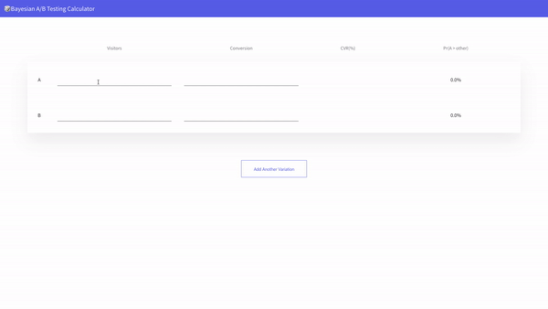

# Simple Bayesian A/B Testing Calculator

### Description

This project was developed based on [Evan Miller Bayesian A/B Testing Article](https://www.evanmiller.org/bayesian-ab-testing.html).

Essentially the project logic is based on OVO(one vs one) algorithm. Because A/B/C/N Bayesian Test calculation required high-cost computation($O(N^{variant count})$)

In order to comparing many Variants, I used a tricky method as followed:

1. `choose the best arm` before calculating the winning probability.
2. and then `compare between the best and the other arm`.

The steps were made faster than Multivariate Bayesian test($O({variant count} * N)$). **But for using this project, you should assume each arm is independent.**

### For using this site ...

Just visit [the site](https://dohyungp.github.io/bayesian-ab-test-calculator)!

### Screenshot

